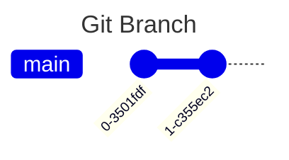
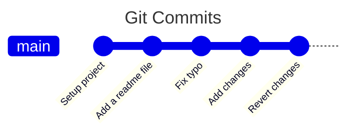
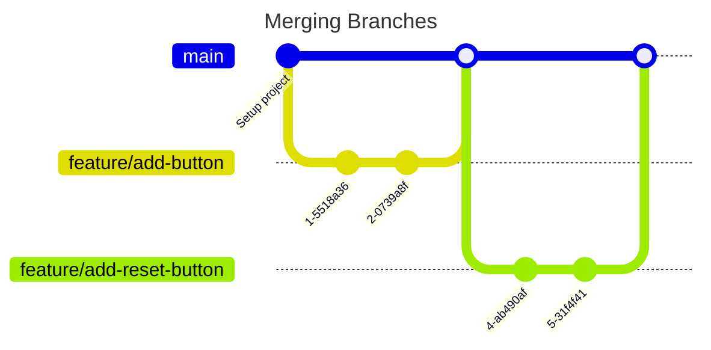
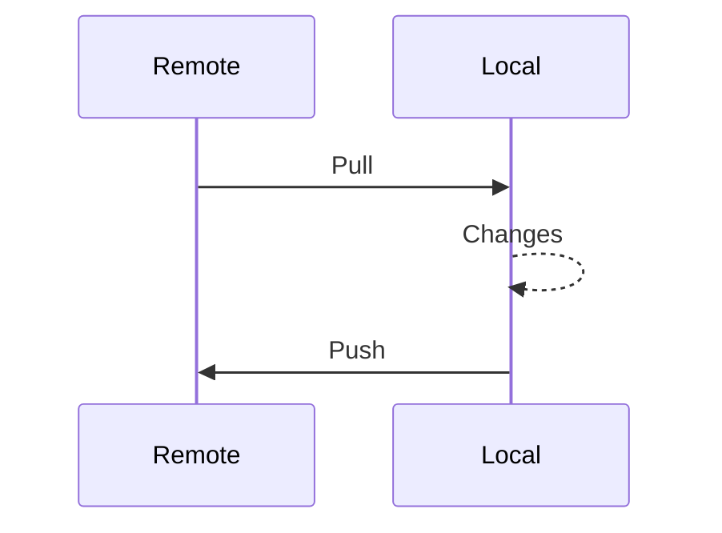
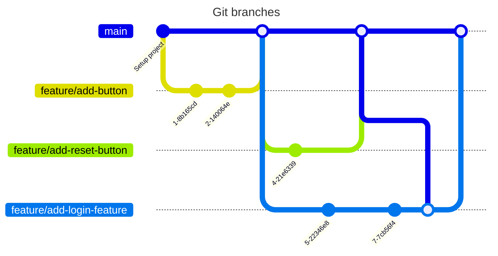

# git init

A guide on getting started with git

---

## Why git

- Track changes
- Collaborate
- Single source of truth
- Backup

---

## Concepts

- branch
- commit
- merge
- push / pull

### branch



```bash
git init
```

---

### commit



```bash
git add .
git commit -m "commit message"
```

---

### merge



```bash
git checkout main
git merge feature/add-button
```

---

### push and pull



```bash
git remote -v
```

```bash
git push
```

```bash
git pull
```



---

## Hands on

### Setup

1. Create a github account - [github.com/signup](https://github.com/signup)
1. Install [git](https://git-scm.com/downloads/win)
1. Install [code](https://apps.microsoft.com/detail/xp9khm4bk9fz7q)
1. Install git [client](https://desktop.github.com/download/)

---

### Tracking changes

1. Commit changes
2. Push changes
3. Revert changes

---

### Collaborate

1. Create a pull request
2. Review a pull request
3. Merge a pull request
4. Pull remote changes
